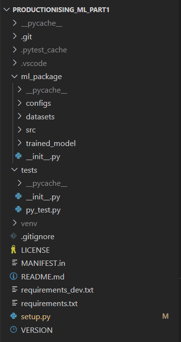
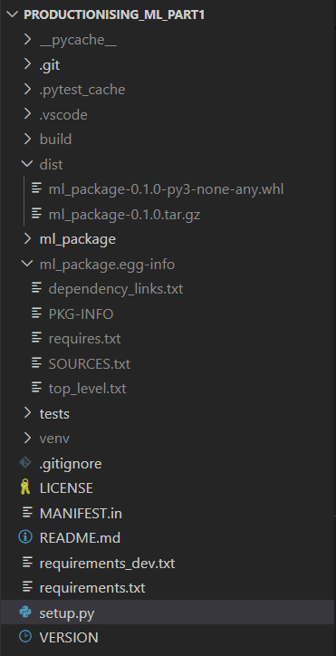

# Productionising_ML_Part1
A guide for budding ML Scientists to learn how to write a production level ML code. Link to medium article to be shared soon.
#### 1. Project Folder Structure

The project folder structure is as follows:

* MANIFEST.in : Added especially if you want to include additional files (like README.md, LICENSE, VERSION, etc.) in your source distribution that are not automatically included by setuptools.
 
* LICENCE : Licence as per your criteria i.e MIT, Apache etc
 
* LICENCE : Licence as per your criteria i.e MIT, Apache etc
 
* requirements.txt : Contains external packages required for our package to work successfuly
 
* requirements_dev.txt : Contains all packages mentioned in requirements.txt plus pytest, setuptools, and wheel required to create the package. We will create our local working environment using requirements_dev.txt
 
* README.md : For project description
 
* setup.py : This script is essential for packaging
 
* VERSION : Contains the version mentioned in  `MAJOR.MINOR.PATCH`
 

#### 2. Instructions to create the package

* Ensure that your pwd is PRODUCTIONING_ML_PART1. Also, ensure that your have created all the nessesary files as mentioned above
 
* Ti run the pytest modules, type teh following in terminal
`pytest tests/`
 
* To create the wheel file, type the following
`python setup.py sdist bdist_wheel`
 
* Once this code is executed two new folders get created namely ***build*** and ***dist*** and the folder structure is as shows
 

 
* Now to install the package from the wheel file as follows.
`pip install dist/ml_package-1.1.0-py3-none-any.whl`
 
* One can now simply import all functionalities as
`from ml_package import train, ConfigReader etc.`
